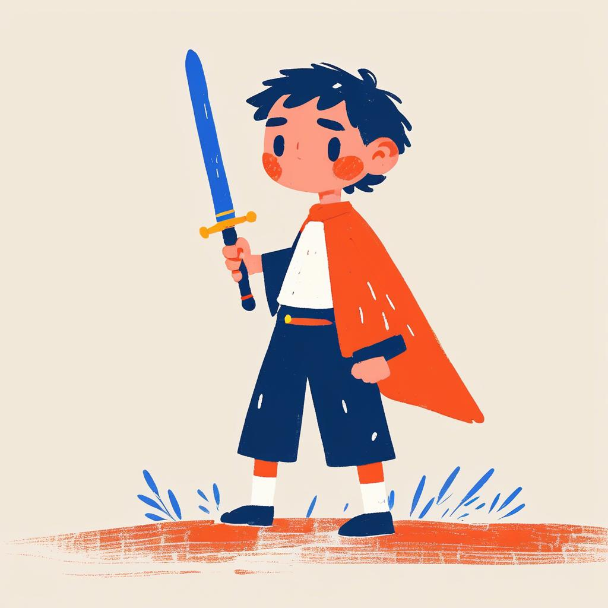
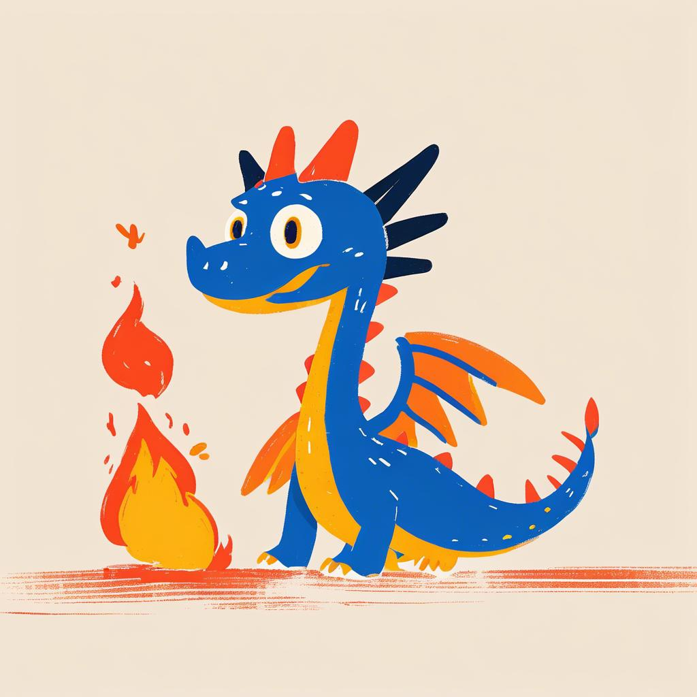
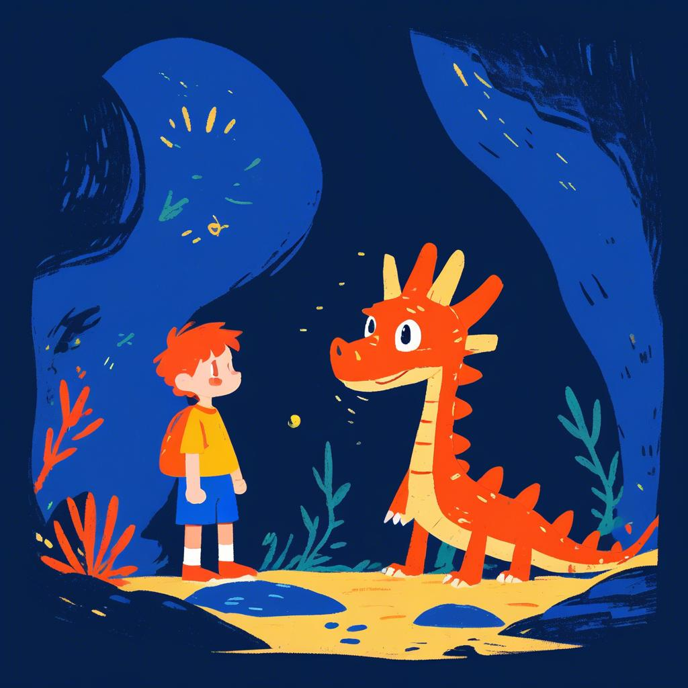
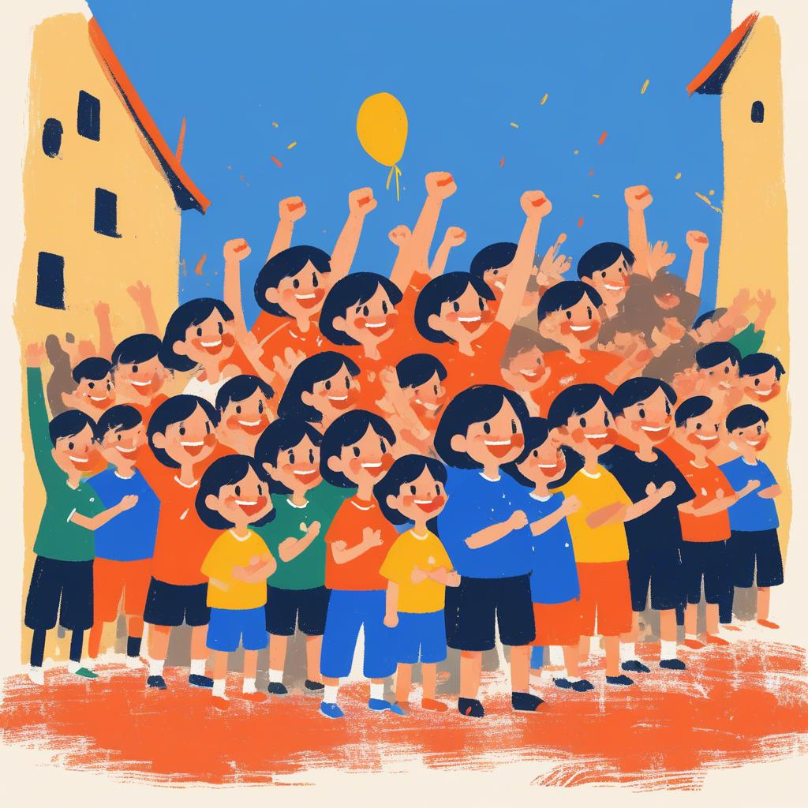
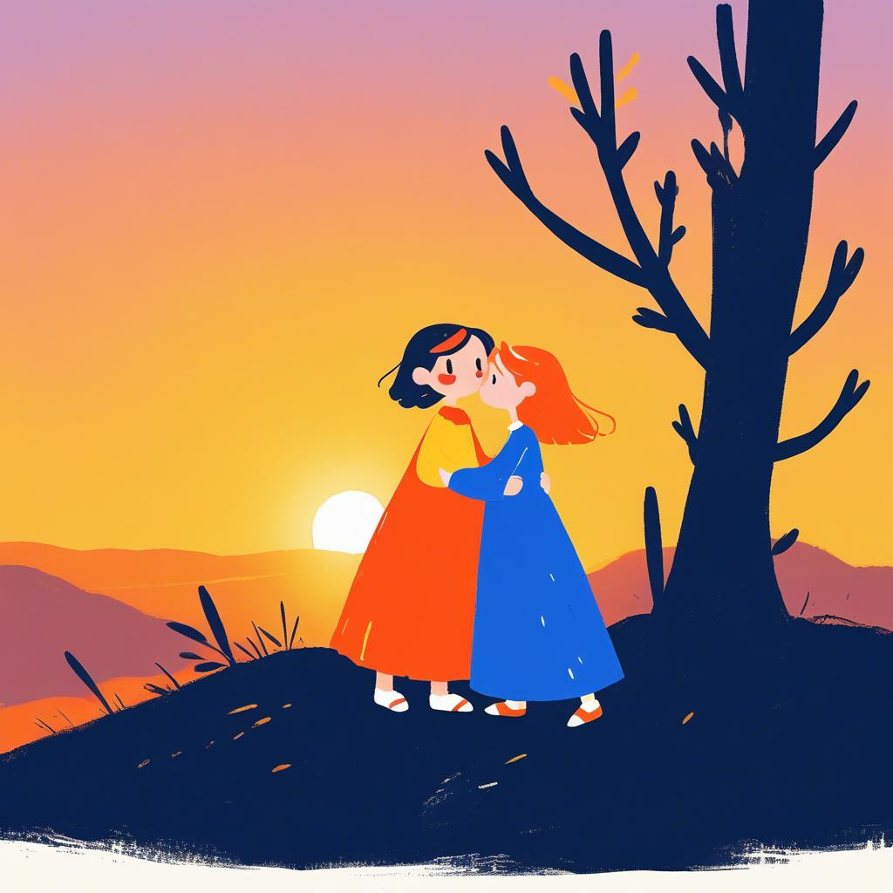

Once upon a time, in the magical kingdom of Evergreen, there lived a brave knight named Luca.

Luca was known far and wide for his courage and kindness.

One day, a ferocious dragon named Scorch terrorized the kingdom, setting fire to the fields and scaring the villagers.

Princess Stella, the ruler of Evergreen, was captured by the dragon and held captive in the dark caves.

Determined to save his kingdom and rescue Princess Stella, Luca embarked on a perilous journey.

He knew he had to confront the mighty dragon to bring peace back to Evergreen.

Armed with his shining sword and unwavering bravery, Luca marched towards the dragon's lair.

As Luca approached the caves, the ground trembled, and the sky darkened.

Scorch emerged from the shadows, breathing fire and roaring ferociously.

Undeterred, Luca stood his ground and called out to the dragon.

A fierce battle ensued, with flames and sparks lighting up the sky.

After a long and fierce struggle, Luca's courage prevailed.

With a swift and precise strike, he vanquished the dragon, saving the kingdom and freeing Princess Stella.

The grateful villagers cheered and celebrated Luca's victory, hailing him as their true hero.

With peace restored to Evergreen, Luca and Princess Stella shared a heartfelt embrace.

Luca had not only saved the kingdom but had also found a true friend in Princess Stella.

As they watched the sunset from the castle walls, Luca realized the true meaning of bravery and kindness.

And so, the brave knight Luca and Princess Stella lived happily ever after, their bond stronger than ever.

The kingdom of Evergreen thrived, and Luca's legacy of courage and compassion echoed through the land for generations to come.

